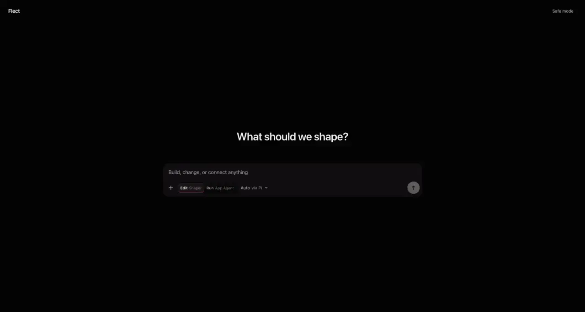

# Flect

> The interface that takes your shape.

[](https://github.com/akua-dev/flect/actions/workflows/quality.yml)


Flect is an open-source, agent-native interface shell. You describe what you
need, the agent builds and repairs it, and the running interface remains the
place where you keep shaping the work.

The agent is not a chatbot beside a static application. It is the programmable
backbone of the interface. Git quietly protects the work underneath, while
typed capabilities keep outside effects inspectable, approved, and revocable.

## A glimpse of the final Flect

Mara opens Flect because her logistics company has outgrown its spreadsheet.
There is no project wizard or framework selector, just an empty canvas and one
question: _What do you need?_

She asks for a live view of today's deliveries. Flect requests read-only access
to the delivery API, then a working interface appears. Mara selects a late
delivery badge and asks the agent to make it calmer. The valid change appears
directly on the running canvas. She drags the driver summary above the map and
Flect updates the ordinary source project behind it.

When a later edit fails to build, the working interface never disappears. The
agent reads the source and runtime diagnostics, repairs the problem, and keeps
going. History shows human descriptions such as _Improved the small-screen
layout_, not a wall of Git terminology. Mara can Undo or restore any earlier
state immediately; her developer can still open the same work as a normal Git
repository.

Flect mostly disappears. What remains is software that is alive,
understandable, and owned by the person using it.

Read the complete story and product boundary in [VISION.md](VISION.md).

## The product promise

- The running interface is the canvas; there is no mandatory preview or review
  ceremony for a valid local UI edit.
- One continuous agent conversation can create, inspect, modify, and repair the
  frontend while it is running.
- People can edit by describing an outcome, selecting what they see, or using
  direct manipulation where it is safe and unambiguous.
- A persistent incremental workspace keeps the agent, compiler, running
  canvas, Git history, and exported source on one canonical revision.
- The last-known-good interface remains usable when an edit or build fails.
- History feels like Undo, Redo, and Restore. Ordinary Git remains available as
  progressive disclosure and as the portable source of truth.
- External effects remain behind typed, bounded capabilities. Flect asks for
  confirmation when authority changes, not for every visual iteration.
- Every supported host feels first-party to its platform. Shared product logic
  never excuses lag, fake native controls, mismatched appearance, or generic
  WebView behavior.

## Project status

The checked-out repository now implements the continuous live-canvas workflow:
one visible conversation, automatic routing between internally isolated agent
authorities, atomic acceptance of valid local UI changes, quiet Git-backed
history, deterministic recovery, responsive platform-aware layout, and an
Astro-on-Vite activation shell. Imported apps, shared artifacts, and new
capabilities still require an explicit **Activate app** or **Discard** decision
because they can change authority.

The static Astro document loads first. Focus or pointer intent arms only the
tiny activation bootstrap; sending a prompt, using the Flect shortcut, or
opening an agent action hydrates the protected Effect workspace through the
custom `client:flect` Astro island. Its stylesheet is a declarative component
resource, and the Effect activation coordinator keeps the static shell visible
until that stylesheet has loaded and the island is ready. Compiler, package,
shell, Worker, and Wasm substrates remain on demand until a typed operation
needs them. Production Astro uses Preact's React compatibility renderer for the
existing workspace components; the direct Vite SPA remains a React fallback.
Official Shadcn v4 components, its Radix primitives, and the official AI
Elements conversation, message, composer, reasoning, and tool components
compile inside that deferred workspace stylesheet/chunk only.
The product intentionally starts from Shadcn's neutral defaults; Flect-specific
styling comes later, without forking interaction behavior. The static Astro
route carries none of the component runtime.
The measured production gates and exact budgets are documented below.

Flect remains under active development. The published v0.2.0 macOS preview is
older than the checked-out live-canvas implementation, and signed/notarized
multi-platform release artifacts still depend on release credentials and clean
platform builders. Delivery evidence is tracked by the
[Flect 1.0 epic](https://github.com/akua-dev/flect/issues/1) and the
[Flect project](https://github.com/orgs/akua-dev/projects/8).

## Try the current developer preview



### Apple Silicon macOS

The current native preview requires Apple Silicon and macOS 12 or newer. It
contains its own Pi runtime; no terminal login or separate Pi installation is
required.

[Download Flect v0.2.0 for Apple Silicon macOS](https://github.com/akua-dev/flect/releases/latest/download/Flect_0.2.0_aarch64.dmg)
·
[SHA-256 checksum](https://github.com/akua-dev/flect/releases/latest/download/Flect_0.2.0_aarch64.dmg.sha256)
·
[Release evidence](https://github.com/akua-dev/flect/releases/latest/download/Flect_0.2.0_aarch64.release.json)

Download the DMG and checksum into the same directory and verify them:

```bash
cd ~/Downloads
shasum -a 256 -c Flect_0.2.0_aarch64.dmg.sha256
```

Open the DMG and drag Flect into Applications. The v0.2.0 app is ad-hoc signed
and unnotarized, so Gatekeeper may block the first launch. After verifying the
checksum, use Finder's **Open** action from the context menu. If quarantine
still blocks the app:

```bash
xattr -dr com.apple.quarantine /Applications/Flect.app
```

Launch Flect, open the model chooser, and connect a provider under **Pi
providers**. Provider credentials stay in Pi's private local store. Sensitive
manual values open in a separate one-use loopback page that Flect's interface
cannot read.

Native update review and ownership-safe uninstall preparation live under
**Diagnostics**. Development builds do not contain an update trust key; public
builds fail closed unless the signed updater and Apple trust evidence are
complete. See [Updates and uninstall](docs/updates-and-uninstall.md).

### Browser and source

```bash
git clone https://github.com/akua-dev/flect.git
cd flect
bun install
bun run dev
```

Open [http://127.0.0.1:5173](http://127.0.0.1:5173). Astro serves the static
activation shell through its Vite development pipeline; the origin-restricted
local Pi runtime listens on `127.0.0.1:3210`. Connect a
provider from the model chooser. Provider credentials remain in Pi and never
enter React state, workspace snapshots, control APIs, browser storage, or
shaped interfaces.

`bun run dev` starts Astro as an explicit background dev server
(`astro dev --background`) alongside the Pi runtime in the foreground, since
Astro daemonizes itself outside an interactive terminal either way. Ctrl-C
stops both cleanly; `bun run dev:stop` also stops a background dev server by
hand if a session ever ends uncleanly.

## What the current slice proves

- in-product Pi provider discovery, authentication, model selection, streamed
  turns, cancellation, and redacted public failures;
- an Effect-owned continuous workspace controller with one protected composer,
  schema-validated interface state, atomic local acceptance, and deterministic
  last-known-good recovery;
- a canonical browser-portable Git repository in OPFS, guarded revision refs,
  persistence across reloads, and complete ordinary-Git export;
- bounded static and single-entry Vite JavaScript, TypeScript, React, Vue, and
  Svelte import from folders, archives, or exact public Git commits, a Worker
  compiler, integrity-checked package resolution, and offline cache;
- deterministic `.flect` capsule import/export, protected provenance and
  capability review, portable sharing, and user-owned forks;
- a typed product-capability registry plus the packable
  [`@flect/product`](packages/product/) SDK and reference integrations;
- an opt-in local `flect` CLI, JSON/SSE, and MCP control surface using the same
  workspace controller as visible UI actions;
- responsive light/dark, forced-colors, reduced-motion, keyboard, Markdown,
  accessibility, 44 px compact touch targets, focus restoration, and bounded
  conversation-continuity behavior;
- browser HTTP/SSE and native private-stdio transports behind the same Effect
  capabilities; and
- optional pure extension logic in a disposable QuickJS/Wasm worker that can
  return inert, schema-decoded intents only.

The native app does not start the browser development server. It launches a
compiled Bun/Pi sidecar and communicates through private NDJSON stdio exposed
to the webview by one narrow Tauri command. When the user enables outside
control, that sidecar additionally exposes the authenticated loopback broker.

## Adopt Flect in a product

`@flect/product` is the separately versioned, browser-portable Effect SDK for
product teams. It defines strict product metadata, recommended `.flect`
experiences, named unary and event operations, compatibility and declarative
migrations, inference ownership, user-state separation, and deterministic
adoption diagnostics. It also exports policy-fixed HTTP/GraphQL and bounded
event host Layers.

Build and verify the current `0.1.0` preview tarball locally:

```bash
bun run product:package
npm install ./dist-product-sdk/flect-product-0.1.0.tgz effect@4.0.0-beta.102
```

This command installs the tarball into a clean temporary consumer, typechecks
it, and runs the smallest offline integration. It does not publish to npm.
Start with the [SDK quickstart](packages/product/README.md), then compare the
[offline, browser-direct, and brokered references](examples/product-sdk/).

Flect still owns all grants, protected review, capsule activation, workspace
Git, safe mode, and recovery. Products supply only named, bounded closures.
Product denial overrides approval; credentials stay inside trusted host
closures; model-provider or inference-owner choice cannot change product
authorization. Product connection records remain separate from personal forks
and exports, and detach preserves that user-owned work.

## Security and product boundary

> Interfaces may reshape the user experience, but may affect the outside world
> only through inspectable, approved, and revocable capabilities.

The generated frontend and browser agent workspace are defense-in-depth
execution realms, not operating-system sandboxes. They cannot invoke a host
shell, native process, system Bun, ambient filesystem, or ambient network.
Credentials remain outside user-generated source and model-visible project
state.

Flect now exports and imports verified declarative `.flect` capsules through a
reviewable candidate flow. It also imports, isolates, persists, restores, and
byte-preservingly re-exports compiled HTML capsules with verified local CSS,
classic scripts, images, fonts, and media in supported browsers.
Configured hosts can verify canonical Ed25519 publisher signatures, show
unknown/revoked/expired/changed/invalid states, and require approved keys;
signatures never grant capabilities. A local fork records its parent and is
explicitly unsigned until its owner signs it again.

The packaged macOS host also includes the first real native capability adapter:
it reads AppKit's system accent color through a fixed Swift/Rust boundary. The
operation is absent in browsers, remains optional to the running capsule, and
cannot execute before an explicit, revocable broker grant. The reusable adapter
contract is documented in
[`docs/native-platform-adapters.md`](docs/native-platform-adapters.md).
Arbitrary Vite plugins/config transforms, CSS modules/preprocessors and asset
URL rewriting, multi-entry routing, capsule-level personal-fork merges
outside the implemented `.flect-share` lifecycle, a public component registry,
custom duration/rate editing in the protected permission UI, database adapters,
privileged native credential transport, remote runtimes, a published signed
updater, notarization, a
macOS App Sandbox entitlement, and Intel, Windows, and Linux packages are not
yet shipped.

See the [capability and sandbox trust model](docs/trust-model.md) for the
authority boundary and the
[browser Bun compatibility matrix](docs/bun-compatibility.md) for supported
commands and deliberate omissions.

## Import an existing interface

Open the composer’s **Actions** menu and choose **Import app project** for a
folder, **Import project archive** for a bounded ZIP/POSIX TAR, or **Import from
Git** for a credential-free public HTTPS repository plus its exact 40-character
commit. Flect recognizes plain static sites and standard single-entry Vite
browser projects, including React JSX/TSX, Vue SFC, and Svelte components. It
checks paths and compatibility without executing source, excludes
secret-shaped and generated dependency files, checkpoints recognizable source
into embedded Git, and builds the exact isolated proposal locally. Git cloning
runs in the isolated WASM Git worker and never accepts a mutable branch name.
When runtime dependencies need resolution, Flect generates or verifies an npm
v3 lock, checkpoints it into the candidate's ordinary Git source, supersedes
the guarded proposal, and compiles only that locked commit.
The current boundary accepts at most 255 retained source files (the capsule
reserves one metadata entry), 32 MiB total, and 100 characters per portable
relative path. Archive preflight also rejects encryption, ZIP64, unsupported
links/types, excessive entries, and expansion beyond 32 MiB. Named unsupported
Vite plugins, `resolve.alias`, `node:` built-ins, CSS preprocessors, and
external Vue blocks are reported before a candidate exists, with a
browser-portable alternative.

The resulting external app opens as an isolated import candidate. Review its
source revision, artifact digest, adaptations, ignored files, capabilities, and
compatibility; exercise the isolated UI; then choose **Activate app** or
**Discard**. This explicit decision exists because imported code can introduce
new authority. Ordinary UI edits requested in the Flect conversation validate,
activate, and checkpoint automatically. An activated build exports as a complete
`.flect` capsule and runs without Vite, npm, or a Flect-hosted service. Vite
config and package scripts are preserved as source but never run; only runtime
dependencies enter the portable package graph.

## Architecture, product, and vision

- [Vision, final product story, and intentional non-capabilities](VISION.md)
- [Users, positioning, and product principles](PRODUCT.md)
- [Visible design system](DESIGN.md)
- [Implemented architecture](ARCHITECTURE.md)
- [Capability and sandbox trust model](docs/trust-model.md)
- [Current Astro/live-canvas performance verification](docs/verification/2026-08-10-astro-live-canvas-verification.md)
- [Packaged macOS local verification](docs/verification/2026-08-10-packaged-macos-local-verification.md)
- [Open-issue implementation audit](docs/verification/2026-08-10-open-issue-audit.md)
- [Final delivery verification](docs/verification/2026-08-11-final-delivery-verification.md)
- [Historical pre-migration performance baseline](docs/verification/2026-08-10-performance-and-native-feel-baseline.md)
- [Astro activation-shell architecture decision](docs/decisions/0003-astro-activation-shell.md)
- [Local agent control](docs/local-control.md)
- [Product capability adoption](docs/product-capabilities.md)
- [Browser Bun compatibility](docs/bun-compatibility.md)
- [Performance and memory budgets](docs/performance.md)
- [Session continuity and recovery](docs/recovery.md)
- [Updates and uninstall](docs/updates-and-uninstall.md)
- [Contributor guide](CONTRIBUTING.md)
- [Flect delivery project](https://github.com/orgs/akua-dev/projects/8)

## Verify and contribute

```bash
bun install --frozen-lockfile
bun run check:all
```

`check:all` runs Effect preparation, the Effect-boundary architecture gate,
lint, type checking, unit and contract tests, production Chromium workflows,
Rust formatting and tests, and the native application build. The architecture
gate rejects native promise fan-out everywhere and ad hoc Promise constructors
or native Promise serialization tails outside tests. Concurrency, callback
lifetimes, cancellation, and failure composition therefore stay explicit in
Effect. The credential-free `Flect quality (advisory)` GitHub workflow runs
these same checks in parallel jobs on every pull request and every change to
`main`, uploading only bounded Playwright failure evidence. This repository's
history is a projection synced from Akua's private monorepo, so this workflow
is advisory rather than a required branch-protection check; see
["How a contribution ships"](CONTRIBUTING.md#how-a-contribution-ships) for
what actually gates a change. `bun run test:pi-smoke` is separate because it
makes one real private turn with the developer's existing Pi provider login.

Release maintainers can reproduce the screenshots, demo, and hero with
`bun run media:release`, then produce the DMG, checksum, MP4, and a
machine-readable evidence manifest with `bun run release:package`. Public mode
also produces the signed Tauri archive and static `latest.json`. The package
gate verifies the mounted DMG, exact executable inventory and architecture,
deep/strict signing, hardened runtime, and observed Gatekeeper/stapling state.
Public mode (`FLECT_PUBLIC_RELEASE=1`) additionally requires updater signing
material from the release environment and fails closed unless source, Developer
ID, notarization, updater signature verification, and independent
reproducibility proof are all present. Tauri's current Isolation Pattern intentionally generates fresh
per-build security material, so independent native-content reproducibility is
recorded as blocked rather than claimed. The media pipeline additionally needs
FFmpeg and the WebP tools `cwebp`, `dwebp`, and `img2webp`.

## License

Flect is licensed under the [Apache License 2.0](LICENSE).
