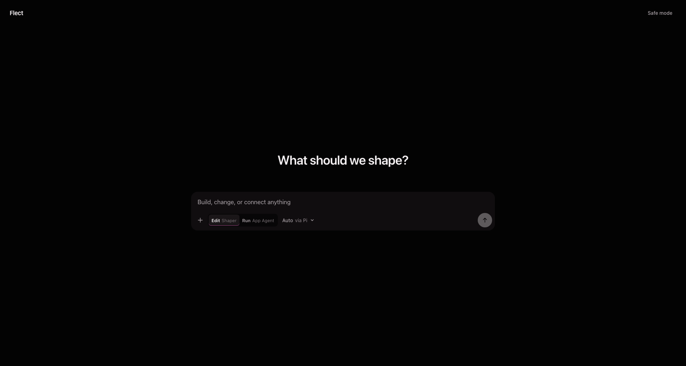
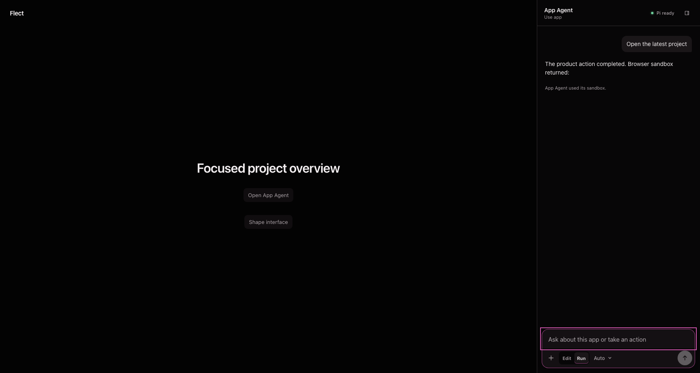

# Flect

> The interface that takes your shape.


Flect is an open-source, agent-native interface shell whose running UI can be
changed from inside itself. It works as a local macOS app and in a browser,
uses [Pi](https://pi.dev) to connect the model providers a user chooses, and
keeps a protected path back when a customized interface fails.

**Flect is a public developer preview of the protected vertical slice:** start
with one excellent composer, shape an interface, test the validated candidate
through its own Preview App Agent, switch instantly between **Use** and
**Shape**, then keep or reject it without replacing accepted state early.

[Download Flect for Apple Silicon macOS](https://github.com/akua-dev/flect/releases/latest/download/Flect_0.2.0_aarch64.dmg)
·
[SHA-256 checksum](https://github.com/akua-dev/flect/releases/latest/download/Flect_0.2.0_aarch64.dmg.sha256)
·
[Release evidence](https://github.com/akua-dev/flect/releases/latest/download/Flect_0.2.0_aarch64.release.json)

## Install Flect

### Apple Silicon macOS

The native preview requires Apple Silicon and macOS 12 or newer. It contains
its own Pi runtime; no terminal login or separate Pi installation is required.
Download the DMG and checksum into the same directory and verify them:

```bash
cd ~/Downloads
shasum -a 256 -c Flect_0.2.0_aarch64.dmg.sha256
```

Open the DMG and drag Flect into Applications. The v0.2.0 app is ad-hoc signed
and unnotarized, so Gatekeeper may block the first launch. After verifying the
checksum, use Finder’s **Open** action from the context menu. If quarantine
still blocks the app:

```bash
xattr -dr com.apple.quarantine /Applications/Flect.app
```

Launch Flect, open the model chooser, and connect a provider under **Pi
providers**. Provider credentials stay in Pi's private local store. Sensitive
manual values open in a separate one-use loopback page that Flect's interface
cannot read.

Native update review and ownership-safe uninstall preparation live under
**Diagnostics**. Development builds do not contain an update trust key; public
builds fail closed unless the signed updater and Apple trust evidence are
complete. See [Updates and uninstall](docs/updates-and-uninstall.md).

### Browser and source

```bash
git clone https://github.com/akua-dev/flect.git
cd flect
bun install
bun run dev
```

Open [http://127.0.0.1:5173](http://127.0.0.1:5173). Vite serves the UI there;
the origin-restricted local Pi runtime listens on `127.0.0.1:3210`. Connect a
provider from the model chooser. Provider credentials remain in Pi and never
enter React state, workspace snapshots, control APIs, browser storage, or
shaped interfaces.

## See it shape


Blank workspaces begin with the Shaper in a centered, protected composer. Ask
for an interface and that same composer moves into the conversation rail while
the validated result appears on the canvas.



The proposal is only a preview until you explicitly keep it. Flect moves into
candidate **Use** automatically so you can question and exercise the proposed
product through an isolated Preview App Agent. **Shape** returns to the warm
Shaper conversation for a correction; the next valid result atomically
supersedes the candidate while accepted state remains unchanged. Reject,
rollback, and safe mode remain deterministic.


Keep the interface to activate its accepted App Agent. Accepted Use, candidate
Use, and Shape retain distinct histories and drafts; candidate App and Shaper
also retain separate Pi sessions and disposable sandbox workspaces.



## Control the live workspace

Open **Diagnostics** and enable local control to let a coding agent use the
same workspace through the public `flect` command, authenticated JSON/SSE API,
or compact MCP mode. Outside actions appear immediately in Flect and use the
same validation, revision, model, safe-mode, and cancellation paths as visible
controls.

From a source checkout:

```bash
bun run flect --
bun run flect -- inspect
bun run flect -- shape "Create a focused project overview"
bun run flect -- target shape
bun run flect -- proposal accept
bun run flect -- permissions list
```

The installed app has one public executable. Run it directly, ask Diagnostics
to install the fixed `~/.local/bin/flect` link, or configure MCP with the same
executable plus the `mcp` argument. App Agent and Shaper also receive a
role-bound, unshadowable `flect` command inside their browser Bash sandbox, so
browser-hosted Flect needs no native CLI. Control is off by default and can be
revoked immediately. See the [command and local control guide](docs/local-control.md)
for role authority, TOON/JSON output, agent integrations, MCP, event
subscriptions, exit codes, and the security model.

## What works today

- authenticated Pi model discovery, explicit selection, streamed turns, stop,
  and redacted public failures;
- in-Flect Pi provider discovery, status, login, protected sensitive entry,
  safe option selection, refresh, and sign-out, plus model-supported reasoning
  controls—without a terminal bootstrap step;
- one protected primary Pi session set for Guardian, accepted App Agent, and
  Shaper, plus a separately acquired candidate session set while Preview App
  Agent is active; Guardian is tool-free while every active interactive
  context receives its own browser-backed Bash workspace;
- Bash-only Shaper proposals through the reserved `flect interface
  validate/propose` path, one bounded corrective retry, and actionable
  field-level validation diagnostics when candidate output is invalid;
- one role-explicit composer that starts centered, moves into an inline,
  resizable right rail, and becomes an accessible sheet on compact screens;
- automatic, deliberate light and dark system appearances with dual-theme
  Markdown syntax, forced-colors and reduced-motion support, keyboard focus
  restoration, and production WCAG 2.2 A/AA gates across protected states;
- explicit Use/Shape workbench targets with separate accepted App, candidate
  App, and Shaper conversations, per-target drafts, candidate-bound context,
  warm correction loops, cancellation, rich Markdown, sticky follow, shell
  results, and visible authority before send;
- bounded refresh/restart continuity for those three drafts and completed role
  conversations, with stale-write rejection and model-free safe-mode
  inspection, export, and isolated discard;
- warm Use/Shape switches under the documented 350 ms production-browser
  budget without a model router call;
- a typed App Agent `request_interface_edit` transition: questions remain in
  Use, while an explicit model tool request can hand a bounded edit instruction
  to Shaper without granting acceptance authority;
- live tool instruments with phase, duration, bounded results, preview links,
  and validation detail plus a bounded, correlated, redacted operation log;
- Effect Schema-validated interface documents and a closed trusted renderer;
- propose, preview, keep, reject, rollback, last-known-good recovery, and a
  compiled `?safe=1` recovery shell;
- a canonical browser-portable Git repository in OPFS, with guarded accepted,
  isolated proposal, and last-known-good refs, reactive `flect repository
  status`, and complete source/history export that opens in ordinary Git;
- inactive-by-default [portable sharing](docs/sharing.md) from local, HTTPS,
  exact public Git, and trusted private sources, with five artifact kinds,
  user-owned guarded forks, Shaper-driven sandbox checkpoints, verified clean
  two-parent updates, explicit guarded Shape conflict resolution, deterministic
  export, and separate remove/delete scope;
- deterministic `.flect` export/import with content-addressed OPFS persistence,
  isolated compiled single-HTML previews, and protected provenance,
  compatibility, signature-presence, and capability review before Keep;
- a host-defined named product-operation registry shared by capsules, App
  Agent, embedded Bash, outside control, JSON, and MCP, with manifest-bound
  digest/revision/workspace-scoped decisions; once, session, workspace,
  persistent, deny, and revoke lifecycle; atomic rate enforcement; protected
  safe-mode inspection; payload-free evidence; agent-visible list/revoke but no
  grant command; bounded JSON results; least-privilege HTTPS and fixed-document
  GraphQL adapters; and bounded cancellable, sequence-resumable event streams
  that never expose raw `fetch`, sockets, documents, or host credentials to the
  app. The packable [`@flect/product`](packages/product/) SDK and three
  [reference products](examples/product-sdk/) prove offline, browser-direct,
  authenticated-broker, inference, extension, update, fork, detach, and event
  behavior without importing application internals;
- bounded credential-free HTTPS (plus loopback development) capsule install
  through the same integrity and review boundary;
- explicit same-ID version comparison with Keep/Reject rather than silent
  update replacement;
- direct bounded import of a plain static site or standard single-entry Vite
  JavaScript/TypeScript/React directory with one root `index.html`, without
  executing source during inspection, Vite config, or package scripts;
- a constrained `@rolldown/browser` Worker compiler for imported JavaScript,
  TypeScript, JSX/TSX, React, and deterministic local CSS, with bounded typed
  artifacts, exact guarded-Git inputs, visible build provenance,
  content-addressed OPFS recovery, and last-successful fallback;
- integrity-checked browser npm resolution with an exact v3 lock checkpointed
  into reviewable source Git, no lifecycle scripts, a content-addressed OPFS
  dependency cache, and registry-offline reuse in the integrated React import
  path;
- a protected composer even when a shaped document omits its own prompt;
- one Pi-visible `bash` tool per interactive role, backed by a role-owned,
  browser-portable working mirror that persists in a separate OPFS namespace
  when available, with reserved Bun-compatible run, build, package, preview,
  and stop commands;
- an unshadowable role-bound `git` surface over the real embedded repository:
  inspection for both roles and guarded `add -A`, `commit -m`, and `restore .`
  for Shaper. App Agent mutation is denied; patch-producing diff awaits a
  browser engine that passes proof;
- browser HTTP/SSE and native private-stdio transports behind the same Effect
  capabilities;
- one AXI-style `flect` command with bounded TOON, JSON compatibility,
  role-bound browser embedding, optional coding-agent context hooks, explicit
  shell-link setup, authenticated JSON/SSE, and MCP stdio mode; and
- optional pure extension logic in a disposable QuickJS/Wasm worker that may
  return inert, schema-decoded intents only.

The native app does not start the browser development server. It launches a
compiled Bun/Pi sidecar and communicates through private NDJSON stdio exposed
to the webview by one narrow Tauri command. When the user enables outside
control, that sidecar additionally exposes the authenticated loopback broker.

## Adopt Flect in a product

`@flect/product` is the separately versioned, browser-portable Effect SDK for
product teams. It defines strict product metadata, recommended `.flect`
experiences, named unary and event operations, compatibility and declarative
migrations, inference ownership, user-state separation, and deterministic
adoption diagnostics. It also exports policy-fixed HTTP/GraphQL and bounded
event host Layers.

Build and verify the current `0.1.0` preview tarball locally:

```bash
bun run product:package
npm install ./dist-product-sdk/flect-product-0.1.0.tgz effect@4.0.0-beta.102
```

This command installs the tarball into a clean temporary consumer, typechecks
it, and runs the smallest offline integration. It does not publish to npm.
Start with the [SDK quickstart](packages/product/README.md), then compare the
[offline, browser-direct, and brokered references](examples/product-sdk/).

Flect still owns all grants, protected review, capsule activation, workspace
Git, safe mode, and recovery. Products supply only named, bounded closures.
Product denial overrides approval; credentials stay inside trusted host
closures; model-provider or inference-owner choice cannot change product
authorization. Product connection records remain separate from personal forks
and exports, and detach preserves that user-owned work.

## Current security and product boundary

The QuickJS worker and browser agent workspace are defense-in-depth execution
realms, not operating-system sandboxes. The source build can execute generated
workspace code through its bounded browser shell, but it cannot invoke a host
shell, native process, system Bun, ambient filesystem, or ambient network.
Flect now exports and imports verified declarative `.flect` capsules through a
reviewable candidate flow. It also imports, isolates, persists, restores, and
byte-preservingly re-exports compiled HTML capsules with verified local CSS,
classic scripts, images, fonts, and media in supported browsers.
Arbitrary Vite plugins/config transforms, CSS modules/preprocessors and asset
URL rewriting, multi-entry routing, Vue/Svelte adapters, archive/Git import,
updates/forks, a component registry, custom duration/rate editing in the
protected permission UI, database adapters, privileged native
product transport, remote
runtimes, a published signed updater, notarization, a
macOS App Sandbox entitlement, and Intel, Windows, and Linux packages are not
yet shipped.

User-shaped documents cannot replace deterministic validation, revision
storage, rollback, safe mode, or the compiled recovery path. See the
[capability and sandbox trust model](docs/trust-model.md) for the authority
boundary and the exact
[browser Bun compatibility matrix](docs/bun-compatibility.md) for supported
commands and deliberate omissions.

## Import an existing interface

Open the composer’s **Actions** menu and choose **Import app project**. Select
one directory with a root `index.html`. Flect currently recognizes plain static
sites and standard Vite browser entrypoints, including React JSX/TSX. It checks
paths and compatibility without executing source, excludes secret-shaped and
generated dependency files before reading them, checkpoints recognizable
source into embedded Git, and builds the exact isolated proposal locally.
When runtime dependencies need resolution, Flect generates or verifies an npm
v3 lock, checkpoints it into the candidate's ordinary Git source, supersedes
the guarded proposal, and compiles only that locked commit.
The current boundary accepts at most 255 source files (the capsule reserves one
metadata entry), 32 MiB total, and 100 characters per portable relative path.
Named unsupported Vite plugins, `resolve.alias`, and `node:` built-ins are
reported before a candidate exists, with a browser-portable alternative.

The resulting app opens as a candidate. Review its source revision, artifact
digest, adaptations, ignored files, capabilities, and compatibility; exercise
the isolated UI; then choose **Keep change** or **Reject**. A kept build exports
as a complete `.flect` capsule and runs without Vite, npm, or a Flect-hosted
service. Vite config and package scripts are preserved as source but never run;
only runtime dependencies enter the portable package graph.

## Architecture and vision

- [Vision and intentional non-capabilities](VISION.md)
- [Implemented architecture](ARCHITECTURE.md)
- [Local agent control](docs/local-control.md)
- [Product capability adoption](docs/product-capabilities.md)
- [Browser Bun compatibility](docs/bun-compatibility.md)
- [Performance and memory budgets](docs/performance.md)
- [Session continuity and recovery](docs/recovery.md)
- [Updates and uninstall](docs/updates-and-uninstall.md)
- [Users and product principles](PRODUCT.md)
- [Design system](DESIGN.md)
- [Contributor guide](CONTRIBUTING.md)
- [Flect delivery project](https://github.com/orgs/akua-dev/projects/8)

## Verify and contribute

```bash
bun install --frozen-lockfile
bun run check:all
```

`check:all` runs Effect preparation, lint, type checking, unit and contract
tests, production Chromium workflows, Rust tests, and the native application
build. `bun run test:pi-smoke` is separate because it makes one real private
turn with the developer’s existing Pi provider login.

Release maintainers can reproduce the screenshots, demo, and hero with
`bun run media:release`, then produce the DMG, checksum, MP4, and a
machine-readable evidence manifest with `bun run release:package`. Public mode
also produces the signed Tauri archive and static `latest.json`. The package
gate verifies the mounted DMG, exact executable inventory and architecture,
deep/strict signing, hardened runtime, and observed Gatekeeper/stapling state.
Public mode (`FLECT_PUBLIC_RELEASE=1`) additionally requires updater signing
material from the release environment and fails closed unless source, Developer
ID, notarization, updater signature verification, and independent
reproducibility proof are all present. Tauri's current Isolation Pattern intentionally generates fresh
per-build security material, so independent native-content reproducibility is
recorded as blocked rather than claimed. The media pipeline additionally needs
FFmpeg and the WebP tools `cwebp`, `dwebp`, and `img2webp`.

## License

Flect is licensed under the [Apache License 2.0](LICENSE).
