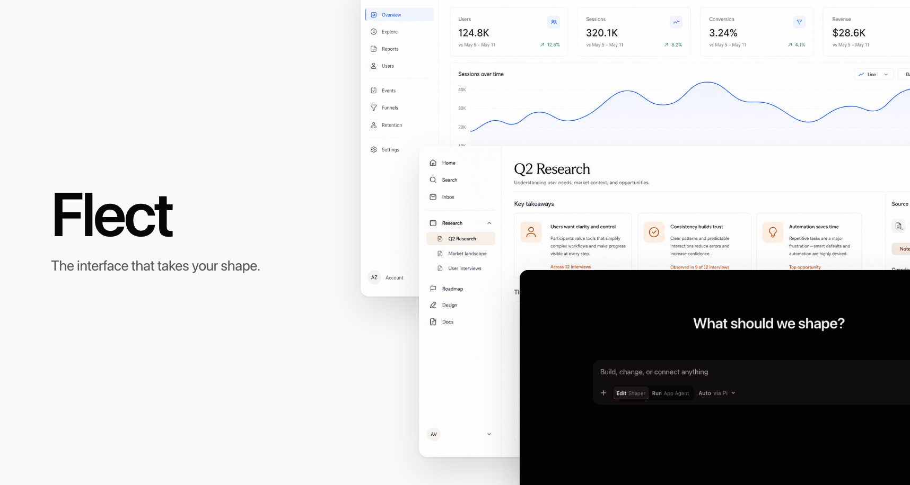

# Flect

> The interface that takes your shape.



Flect is an open-source, agent-native shell for interfaces that can be changed
from inside themselves. It runs as a macOS desktop application and in a normal
browser, uses models already authenticated through [Pi](https://pi.dev), and
keeps the interface-shaping workflow behind typed Effect capabilities.

The first native slice is working: ask Pi a question, open the Interface Shaper,
describe a change, preview the schema-validated result, keep or reject it, and
roll back to the last known good interface.

## Why Flect

The agent is not a chatbot added beside a static application. It is the
programmable backbone of the interface. A product team can ship an excellent
recommended experience while leaving every user free to adapt it.

Flect keeps the protected core small:

- React renders only a closed set of validated interface nodes.
- Effect owns contracts, workflows, resources, streams, revisions, and
  recovery.
- Pi owns model authentication and runs distinct Guardian and Shaper sessions.
- Tauri packages the shared web interface without exposing the native Pi
  runtime on a localhost port.
- Optional pure extension logic runs in a disposable QuickJS WebAssembly worker
  and may return inert, schema-decoded intents only.

## Where Flect is going

Flect is building toward a universal sandboxed interface shell. People will be
able to create or import supported web interfaces, shape them while they run,
package them as portable `.flect` capsules, connect them to explicitly approved
product and native capabilities, and share or fork the result.

The defining boundary is simple: interfaces may reshape the user experience,
but may affect the outside world only through inspectable, approved, and
revocable capabilities. Shared components never receive ambient shell,
filesystem, network, credential, native, Pi, or backend authority.

## Run in a browser

Flect requires Bun and a model login supported by Pi.

```bash
bun install
bunx pi
```

Run `/login` inside Pi, complete a provider login, quit Pi, then start Flect:

```bash
bun run dev
```

Open [http://127.0.0.1:5173](http://127.0.0.1:5173). Browser development uses
an origin-restricted runtime on `127.0.0.1:3210`; Pi credentials never enter
browser storage.

## Run as a macOS app

Install the Rust and Tauri prerequisites, then run:

```bash
bun run dev:desktop
```

For an application bundle:

```bash
bun run build:desktop -- --bundles app
open src-tauri/target/release/bundle/macos/Flect.app
```

The packaged app starts a compiled Bun/Pi sidecar and talks to it through
private NDJSON stdio proxied by a narrow Tauri command. It does not start the
browser development HTTP server.

## What works today

- authenticated Pi model discovery and explicit model selection;
- separate, in-memory, tool-free Guardian and Shaper Pi sessions, with
  model-keyed lifecycle cleanup and a bounded runtime registry;
- streamed turns, cancellation, redacted public failures, and finalized-text
  recovery when a provider emits no live text delta, with typed non-destructive
  busy conflicts for overlapping work;
- model-backed interface proposals using a strict recursive Effect Schema;
- preview, keep, reject, a durable versioned revision journal, rollback,
  last-known-good state, corrupt-journal recovery, and a compiled `?safe=1`
  launcher;
- a trusted renderer for `stack`, `text`, `prompt`, `button`, `divider`, and
  `agent-panel` nodes, plus a protected composer when a shaped document omits
  its own prompt;
- strict extension manifests and a QuickJS-NG/WASM logic sandbox with resource
  limits and no ambient browser, network, process, module, Tauri, or Pi access;
- an explicit capability broker that requires both manifest declaration and an
  explicit grant before invoking the current interface-local adapter;
- browser and native transports behind the same Effect service; and
- automated production-build Chromium coverage for chat, shaping, accept,
  reject, persistence, rollback, corrupt-journal recovery, keyboard use,
  reduced motion, sandbox isolation, and compact layout.

The current UI uses the Guardian only for a short, typed recovery diagnostic
when rollback fails. It cannot change revisions or replace deterministic
validation, safe mode, or rollback.

## Security boundary

The QuickJS worker is a defense-in-depth **logic sandbox**, not an operating
system sandbox. Flect does not currently execute native extensions, shell
commands, filesystem code, or arbitrary generated React. Extension sharing,
product/API capability adapters, privileged host brokerage, remote runtimes,
signing, notarization, and a macOS App Sandbox entitlement are not part of
this slice.

See the [trust model](docs/trust-model.md) for the intended authority boundary.

## Documentation

- [Vision and product boundary](VISION.md)
- [Users, positioning, and product principles](PRODUCT.md)
- [Implemented architecture](ARCHITECTURE.md)
- [Capability and sandbox trust model](docs/trust-model.md)
- [Flect delivery project](https://github.com/orgs/akua-dev/projects/8)
- [Flect 1.0 delivery epic](https://github.com/akua-dev/flect/issues/1)

## Verify

```bash
bun run check:all
bun run test:pi-smoke
```

`check:all` includes lint, type checking, unit tests, production-build
Playwright tests in real Chromium, Rust tests, and a macOS application build.
The Pi smoke is separate because it uses the developer's existing provider
login.

## License

Flect is licensed under the [Apache License 2.0](LICENSE).
