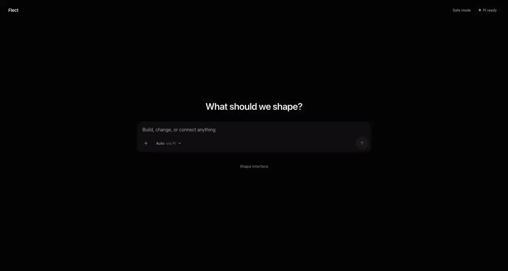
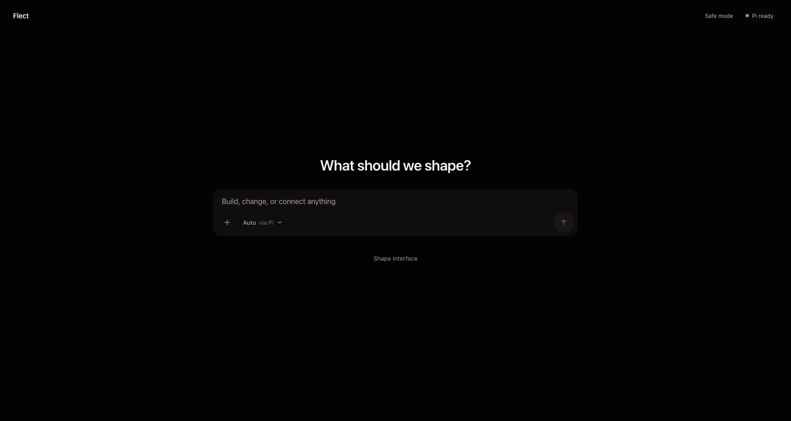
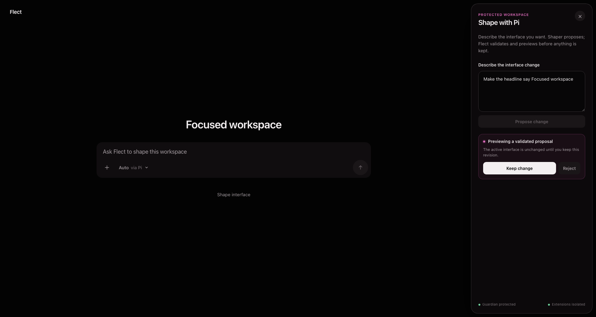

# Flect

> The interface that takes your shape.


Flect is an open-source, agent-native interface shell whose running UI can be
changed from inside itself. It works as a local macOS app and in a browser,
uses models already authenticated through [Pi](https://pi.dev), and keeps a
protected path back when a customized interface fails.

**v0.1.1 is a public developer preview of the protected vertical slice:** talk
to Pi, propose an interface revision, inspect the preview, keep or reject it,
roll back, or bypass custom state in safe mode.

[Download Flect for Apple Silicon macOS](https://github.com/akua-dev/flect/releases/latest/download/Flect_0.1.1_aarch64.dmg)
·
[SHA-256 checksum](https://github.com/akua-dev/flect/releases/latest/download/Flect_0.1.1_aarch64.dmg.sha256)

## Install Flect

### Apple Silicon macOS

The native preview requires Apple Silicon, macOS 12 or newer, and a one-time Pi
provider login. With [Bun](https://bun.sh) installed:

```bash
bunx pi
```

Run `/login` inside Pi, authenticate a supported provider, then quit Pi.
Download the DMG and checksum into the same directory and verify them:

```bash
cd ~/Downloads
shasum -a 256 -c Flect_0.1.1_aarch64.dmg.sha256
```

Open the DMG and drag Flect into Applications. The v0.1.1 app is ad-hoc signed
and unnotarized, so Gatekeeper may block the first launch. After verifying the
checksum, use Finder’s **Open** action from the context menu. If quarantine
still blocks the app:

```bash
xattr -dr com.apple.quarantine /Applications/Flect.app
```

### Browser and source

```bash
git clone https://github.com/akua-dev/flect.git
cd flect
bun install
bunx pi
```

Run `/login` inside Pi, quit Pi, then:

```bash
bun run dev
```

Open [http://127.0.0.1:5173](http://127.0.0.1:5173). Vite serves the UI there;
the origin-restricted local Pi runtime listens on `127.0.0.1:3210`. Provider
credentials remain in Pi and never enter browser storage.

## See it shape



The protected shell starts with an excellent default and keeps shaping,
rollback, safe mode, model selection, send, and stop within reach.



The Shaper uses a separate Pi session, validates its proposal, and previews it
before the active interface changes.



## What works today

- authenticated Pi model discovery, explicit selection, streamed turns, stop,
  and redacted public failures;
- separate Guardian and Shaper Pi sessions with independent lifecycle state;
  Guardian is tool-free and Shaper receives only Flect's browser-backed Bash;
- Effect Schema-validated interface documents and a closed trusted renderer;
- propose, preview, keep, reject, rollback, last-known-good recovery, and a
  compiled `?safe=1` launcher;
- a protected composer even when a shaped document omits its own prompt;
- one Pi-visible `bash` tool backed by a role-owned browser workspace, with
  reserved Bun-compatible run, build, package, preview, and stop commands;
- browser HTTP/SSE and native private-stdio transports behind the same Effect
  capabilities; and
- optional pure extension logic in a disposable QuickJS/Wasm worker that may
  return inert, schema-decoded intents only.

The current native app does not start the browser development server. It
launches a compiled Bun/Pi sidecar and communicates through private NDJSON
stdio exposed to the webview by one narrow Tauri command.

## Current security and product boundary

The QuickJS worker and browser agent workspace are defense-in-depth execution
realms, not operating-system sandboxes. The source build can execute generated
workspace code through its bounded browser shell, but it cannot invoke a host
shell, native process, system Bun, ambient filesystem, or ambient network.
Flect does not yet ship portable `.flect` capsules, a component registry,
canonical OPFS/Git workspaces, product/API adapters, privileged host brokerage,
remote runtimes, automatic updates, notarization, a macOS App Sandbox
entitlement, or Intel, Windows, and Linux packages.

User-shaped documents cannot replace deterministic validation, revision
storage, rollback, safe mode, or the compiled recovery path. See the
[capability and sandbox trust model](docs/trust-model.md) for the authority
boundary and the exact
[browser Bun compatibility matrix](docs/bun-compatibility.md) for supported
commands and deliberate omissions.

## Architecture and vision

- [Vision and intentional non-capabilities](VISION.md)
- [Implemented architecture](ARCHITECTURE.md)
- [Browser Bun compatibility](docs/bun-compatibility.md)
- [Users and product principles](PRODUCT.md)
- [Design system](DESIGN.md)
- [Contributor guide](CONTRIBUTING.md)
- [Flect delivery project](https://github.com/orgs/akua-dev/projects/8)

## Verify and contribute

```bash
bun install --frozen-lockfile
bun run check:all
```

`check:all` runs Effect preparation, lint, type checking, unit and contract
tests, production Chromium workflows, Rust tests, and the native application
build. `bun run test:pi-smoke` is separate because it makes one real private
turn with the developer’s existing Pi provider login.

Release maintainers can reproduce the screenshots, demo, hero, DMG, checksum,
and MP4 with `bun run media:release` and `bun run release:package`. The media
pipeline additionally needs FFmpeg and the WebP tools `cwebp`, `dwebp`, and
`img2webp`.

## License

Flect is licensed under the [Apache License 2.0](LICENSE).
