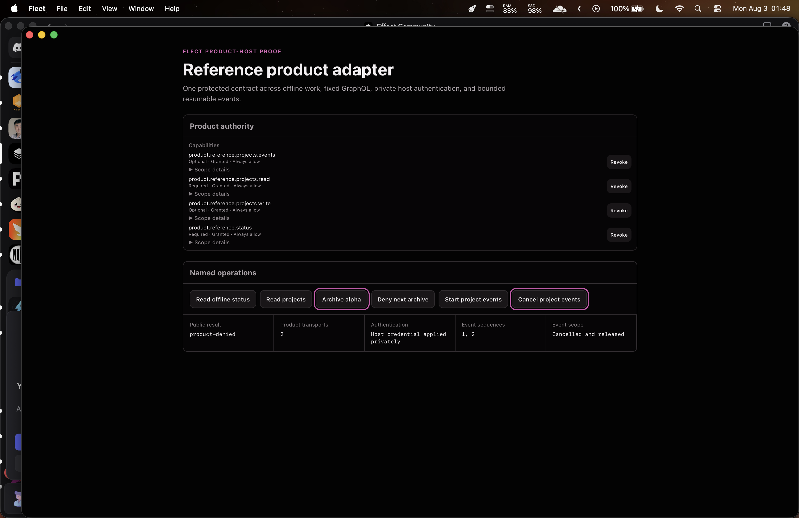
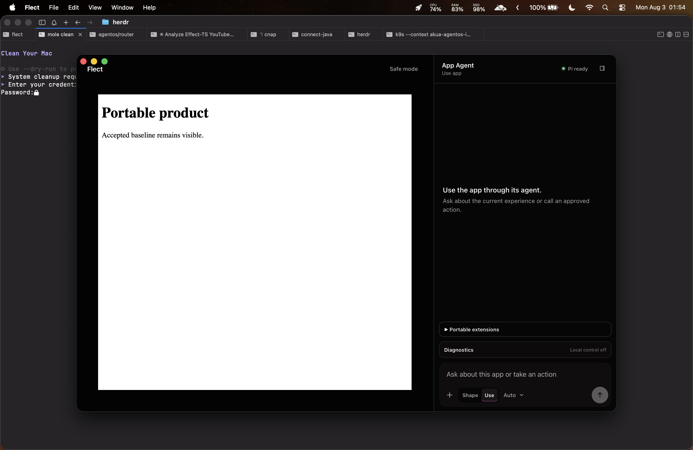

# Product adapter verification — 2026-08-03

## Outcome

Flect now provides schema-defined, Effect-owned product adapters for scoped
HTTPS, fixed-document GraphQL, and bounded sequence-aware event subscriptions.
Capsules and agents continue to receive only named operations and bounded JSON.
Trusted host composition owns endpoints, documents, credentials, product
authorization, event connectors, limits, reconnect, and cleanup.

The executable reference product composes one offline operation, a
browser-direct GraphQL query, an authenticated fixed mutation, and a resumable
event subscription. User approval and product authorization remain independent.
Changing inference ownership between user-controlled Pi and product-provided
inference leaves the operation result, capability scope, decision binding, and
authorization behavior unchanged.

## Evidence boundary

The implementation is based on Git commit
`32d20f5dcb82af6cd53db9188bb029dd0d4012e4` plus the scoped PR worktree on
`codex/flect-self-contained-shaper`. The evidence below was generated from that
uncommitted, intentionally dirty worktree on 2026-08-03. It does not claim a
commit, push, release, Developer ID signature, or notarization. Issue #7 remains
open for review and delivery.

## Focused contract and browser proof

The focused adapter command passed 49 of 49 Vitest cases across 11 files. It
covered strict GraphQL and event schemas, fixed-document construction, private
credential insertion and defect sanitization, denial before transport, byte and
deadline limits, transport-neutral unary dispatch, bounded event backpressure,
strict sequence order, finite reconnect with cursor resume, cancellation, live
revocation, reference composition, and deterministic capsule instructions.

Production Chromium then passed 13 of 13 related workflows in 31.9 seconds:

```text
bunx playwright test tests/e2e/product-adapter.spec.ts \
  tests/e2e/product-capability.spec.ts \
  tests/e2e/portable-extensions.spec.ts \
  tests/e2e/capsule-frame.spec.ts --project=chromium
```

The reference workflow first proves an ungranted query returns `denied` with
zero product transports. Protected user decisions then grant four exact
capabilities. The browser invokes offline status, a fixed project query, and an
authenticated archive mutation; the visible result contains no credential.
Arming product denial makes the next mutation return `product-denied` without
incrementing transport count. The event connector delivers ordered sequences 1
and 2, cancellation releases its scope, persistent grants survive reload, and
offline status remains usable afterward. Browser console and page errors stay
empty, and the private diagnostic credential never appears in the DOM.

## Complete gate

A fresh `bun run check:all` exited 0 against the exact final source and rebuilt
the ordinary macOS artifact:

- Effect checkout: `cccd029ae0124a33254b4094f1bc9c06cd43324e`
- Biome: 353 files checked with no fixes or warnings
- TypeScript project build: passed
- Vitest: 122 files passed, 1 skipped; 683 tests passed, 1 skipped in 12.51 s
- Playwright Chromium: 65 of 65 workflows passed in 2.5 min
- Rust: 21 of 21 native tests passed
- Tauri: ordinary thin arm64 `Flect.app` built and ad-hoc signed
- `git diff --check`: passed

The Vite build reported known browser externalization and large-chunk warnings;
they did not fail the build. The complete performance workflow also stayed
inside its committed budgets and printed the measured startup, interaction,
transfer, Markdown, heap-growth, and cancellation values.

## Packaged macOS dogfood

A temporary packaged diagnostic variant exposed the same production contracts
through a native Tauri WebView. It was exercised through macOS accessibility
controls, terminated, relaunched, and exercised again before the ordinary build
was restored.

The native run proved:

- an ungranted read was denied with zero transports;
- all four exact grants persisted across process restart;
- offline status recovered as `{"status":"ready"}`;
- GraphQL query and authenticated mutation completed;
- the credential was represented only as “Host credential applied privately”;
- product denial returned `product-denied` while transport count stayed at 2;
- event sequences were exactly `1, 2`;
- cancellation ended as “Cancelled and released”.



The first direct-child accessibility selector could not reach WebView buttons.
The dogfood recovered by enumerating the window's complete AX tree and selecting
the exact `AXButton` names. A foregrounding race with cmux was recovered by
reactivating the exact bundle before evidence capture. Neither affected product
state, and the relaunch proof also demonstrated persistent recovery.

## Exact installed artifact

The ordinary artifact produced by the final gate replaced the prior installed
app after that app was moved recoverably to:

```text
/Users/robin/.Trash/Flect-before-product-adapter-20260803-0152.app
```

A checksum-aware dry-run `rsync -ainc --delete` reported no source/install
differences. The bundle contains 4 files and is 90 MiB. Exact executable hashes
match between the gated source and `/Applications/Flect.app`:

```text
flect
10fd82d616bec636100f140370dfdd2a0f915daf359b131aab7026e083c196d2

flect-runtime
05be4277fefb453551358649bba50c97b0f74d7f23fe04b05fbddcd206c08abc
```

`codesign --verify --deep --strict` passed. Signature facts are intentionally
explicit: identifier `dev.akua.flect`, thin arm64, hardened runtime, ad-hoc
signature, and no Team ID. Gatekeeper rejected the unreleased ad-hoc build with
exit 3, and stapler found no notarization ticket with exit 65. These are expected
for local dogfood and are not presented as distributable release signing.

The installed ordinary app was launched once. Process and accessibility proof
showed one main process, one private runtime sidecar, exactly one window, Pi
ready, and Local control off. The screenshot records the same protected state.



## Limitations

- The stock Flect distribution registers no product-specific operations. A
  product host composes its own trusted Layer or future SDK package.
- Browser-direct HTTP and GraphQL remain subject to CORS. The reference bearer
  value is deterministic test data, not a production browser credential.
- OS-keystore authentication and CORS-independent native transport require a
  protected native adapter behind the same contract and are not included.
- Event connectors are trusted host code. Flect bounds and supervises their
  public stream boundary; it does not turn arbitrary connector code into an
  untrusted sandbox.
- Database adapters, arbitrary transport plugins, and the separately versioned
  public adoption SDK remain later work.
- Git delivery is not authorized in this task. No commit or push was performed.
