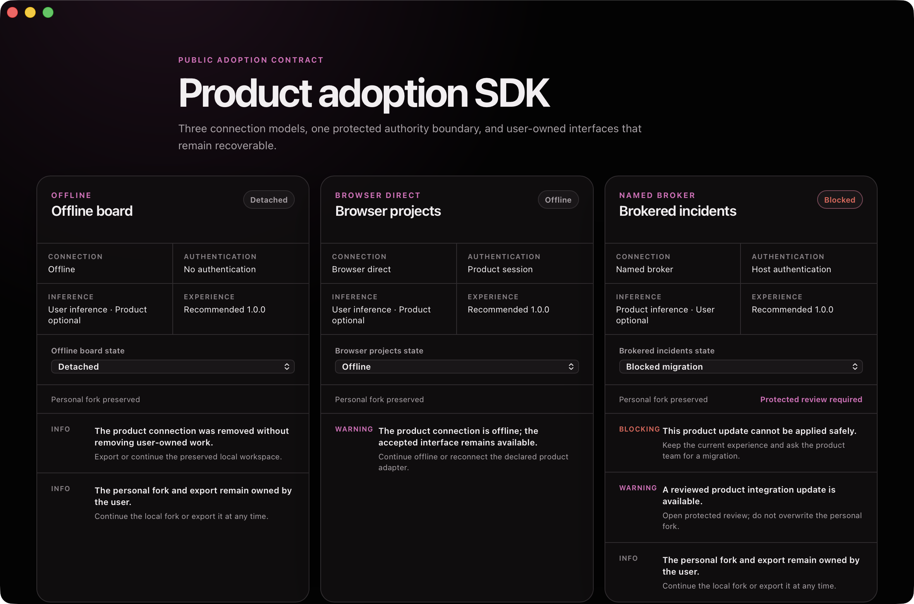
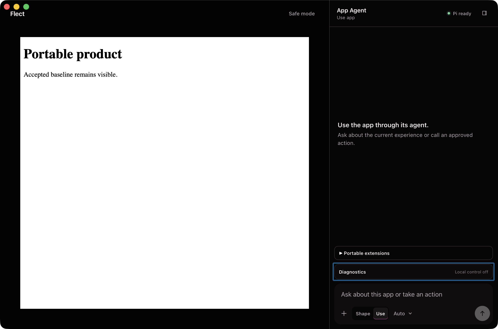

# Product-adoption SDK verification — 2026-08-03

## Outcome

Flect now has a separately versioned, packable `@flect/product` package for
product contracts, deterministic adoption, and trusted host adapters. Flect's
protected runtime consumes those public definitions at one bridge while
retaining grants, user state, safe mode, and recovery. Three public-only
references prove offline, browser-direct, and brokered adoption without giving
products authority over Flect state.

This evidence covers the source package and local product-adoption dogfood. It
does not claim that the package is published or that the macOS app is signed for
public distribution.

## Evidence boundary

The implementation is based on Git commit
`32d20f5dcb82af6cd53db9188bb029dd0d4012e4` plus the scoped PR worktree on
`codex/flect-self-contained-shaper`. The worktree was intentionally dirty with
the broader Flect PR work when this evidence was produced. No commit, push,
merge, npm publish, GitHub release, issue closure, Developer ID signature, or
notarization was performed.

## Public package and protected host boundary

`@flect/product` owns the Effect Schema contracts for capsules, extensions,
capabilities, HTTP, GraphQL, events, integration definitions, compatibility,
connection records, user-owned state, adoption diagnostics, and detach. Its
public Effect services expose fixed operations and trusted callback adapters;
they do not expose Flect's grant store, accepted revision, recovery shell, or
credentials.

The package exports exactly three entry points:

```text
@flect/product
@flect/product/contracts
@flect/product/host
```

The peer dependency is exactly `effect@4.0.0-beta.102`. Existing Flect shared
and capability paths are compatibility re-exports, leaving one package-owned
source of truth. `makeProductIntegrationLayer` is the private Flect bridge: it
registers validated public operations and events while protected policy and
grant decisions remain supplied by Flect.

## Three reference products

- `offline-board.ts` lists and adds local cards without transport or product
  authentication. Its optional guide extension is role-scoped to App Agent and
  Shaper. Update and detach proof preserve the user's fork and export digests.
- `browser-projects.ts` uses one fixed GraphQL document and two ordered,
  cancellable events. Offline adoption is explicit and never replaces an
  accepted interface.
- `brokered-incidents.ts` keeps its credential in named trusted host closures,
  exposes fixed list/acknowledge operations, and proves product denial occurs
  before the callback starts.

Each reference was exercised under user-owned and product-owned inference.
Inference ownership changed model routing metadata, not operation authority,
capability scope, or product decisions.

## Focused proof and packed consumer

The final focused command passed 24 of 24 cases across eight files:

```text
bunx vitest run scripts/product-sdk-package.test.ts \
  packages/product/src/contracts.test.ts \
  packages/product/src/host.test.ts \
  packages/product/src/integration.test.ts \
  packages/product/src/adoption.test.ts \
  src/capabilities/product-integration.test.ts \
  src/capabilities/product-adoption-diagnostic.test.tsx \
  examples/product-sdk/reference-products.test.ts
```

The package test creates a clean temporary consumer, installs the local exact
Effect peer and tarball, compiles against the published entry points, and runs a
real offline integration. The final package command produced:

```text
filename: flect-product-0.1.0.tgz
SHA-256: 24a7f45bbff90cb78c74a47525478c6c2c2fb285fad5e8cd1c2487a678e2629c
size: 47,976 bytes
entries: 63
```

The archive contains only `LICENSE`, `README.md`, `package.json`, and compiled
`dist` JavaScript, declarations, and source maps. The clean consumer has no
repository-relative import. The tarball remains under ignored
`dist-product-sdk/`; it was not published.

Read-only npm availability checks on 2026-08-03 returned 404 for
`@flect/product`, `@flect/product-sdk`, and `@akua-dev/flect-product`. That is
name-conflict evidence only; it does not establish registry namespace
ownership.

## Production Chromium adoption proof

`tests/e2e/product-adoption.spec.ts` drives the real SDK evaluator through a
test-only diagnostic route built behind the existing product-capability flag.
It covers:

- offline ready, update, preserved fork, and detached states;
- browser ready, offline, capability review, and extension review;
- broker ready, authentication unavailable, incompatible host, and blocked
  migration states;
- deterministic diagnostic order and explicit recovery actions;
- keyboard focus, responsive containment, reload, and axe WCAG checks; and
- no private credential in the DOM, request URLs, browser console, or page
  errors.

The final complete Playwright run passed all 66 production-Chromium workflows,
including the adapter, capability, capsule, extension, accessibility,
performance, embedded AXI, and adoption paths.

## Packaged native adoption dogfood

A temporary packaged diagnostic build rendered the three reference products in
the real Tauri WebView. Through macOS accessibility controls it selected and
verified offline update/detach, browser offline, broker authentication
unavailable, and broker blocked-migration states. The diagnostic process was
then terminated and its temporary window URL was removed before the ordinary
gate rebuilt Flect.



The screenshot is 2360 by 1562 pixels with SHA-256
`15083ae3ab387893fb14c30a0e65916cd8f2f13223e6e8902730170ac870c1dd`.
No diagnostic URL remains in `src-tauri/tauri.conf.json`.

## Complete gate

A fresh final `bun run check:all` exited 0 against the exact source used for
the installed ordinary artifact:

- pinned Effect checkout:
  `cccd029ae0124a33254b4094f1bc9c06cd43324e`;
- Biome: 386 files checked with no fixes;
- TypeScript project build: passed;
- Vitest: 130 files passed, 1 skipped; 707 tests passed, 1 skipped in 11.61 s;
- Playwright: 66 of 66 production-Chromium workflows passed in 2.3 min;
- Rust: 21 of 21 native tests passed;
- Tauri: ordinary thin-arm64 `Flect.app` built and ad-hoc signed; and
- `cargo fmt --check` and `git diff --check`: passed.

The production performance proof measured 420 ms interactive startup, 6 ms
composer input, 44 ms model-menu opening, 35 ms worst target switch, 301 ms
Markdown rendering, 9,394,012 bytes repeated-cycle heap growth, and 338 ms
cancellation acknowledgement. Vite reported the existing browser
externalization and large-chunk warnings; neither failed the build.

One initial complete-gate run exposed a test teardown race: the embedded AXI
authority assertion had observed the final event but not the closing prompt
response, so Chromium reported `net::ERR_ABORTED` when Playwright closed the
page. The test now waits for that exact public HTTP response to finish. The
scenario passed three consecutive Chromium repetitions before the 66-of-66
final run. A separate focused package check was once invoked with Bun's native
test runner, which cannot load `@effect/vitest`; it ran zero tests. The required
Vitest invocation then passed 1 of 1 and the eight-file focused command passed
24 of 24.

## Exact installed ordinary app

The pre-existing installed app was closed and moved recoverably to:

```text
/Users/robin/.Trash/Flect-before-product-sdk-20260803-031105.app
```

The gated bundle was copied to `/Applications/Flect.app`. A checksum-aware
`rsync -ainc --delete` dry run reported no source/install differences. Both
bundles contain four files and occupy 91,660 KiB on disk. Source and installed
executable hashes are identical:

```text
flect
b240f31d1e01d5116ea932dadf43edc07cf934efe60747f112c13a06cc431db9

flect-runtime
af9d6bfa2d35f640a238204537e16cdd201920fc061a574ab1e6fa0a00d03ceb
```

`codesign --verify --deep --strict` passed. Signature facts are explicit:
identifier `dev.akua.flect`, thin arm64, hardened runtime, ad-hoc signature, and
no Team ID. Gatekeeper rejected the local build with exit 3 and stapler found
no ticket with exit 65, as expected for unreleased dogfood. This is not public
distribution signing.

The installed app was launched once. Process inspection found one main process
and its one direct private-runtime child. macOS accessibility found exactly one
window with `Flect`, `Pi ready`, an enabled App Agent composer, and
`Local control off`. That ordinary window remains open; no diagnostic or stale
Flect window remains.



The installed screenshot is 2360 by 1562 pixels with SHA-256
`30e2b3ac890e873716870cd93e546e0f1c6459e17aad73d87fe24868976bf230`.

## Limitations

- `@flect/product` is version `0.1.0`, remains unpublished, and has no stable
  1.0 compatibility promise. The exact Effect 4 beta peer is intentional.
- The stock app registers no product integration. Adopters compose their own
  integration at the trusted host edge.
- Browser-direct HTTP and GraphQL remain subject to CORS. Native
  CORS-independent transport and OS-keystore authentication are not included.
- Event connectors and broker callbacks are trusted host code. Their public
  data is bounded and sanitized, but arbitrary connector code is not an
  untrusted sandbox.
- Products cannot grant capabilities, overwrite user forks, erase exports,
  accept revisions, or replace safe mode. Detach removes only the connection.
- Npm availability checks do not reserve a scope or package name.
- The installed ad-hoc macOS build is local dogfood, not a downloadable release.
- GitHub delivery remains review work: no commit, push, release, publish, or
  issue closure was performed.
