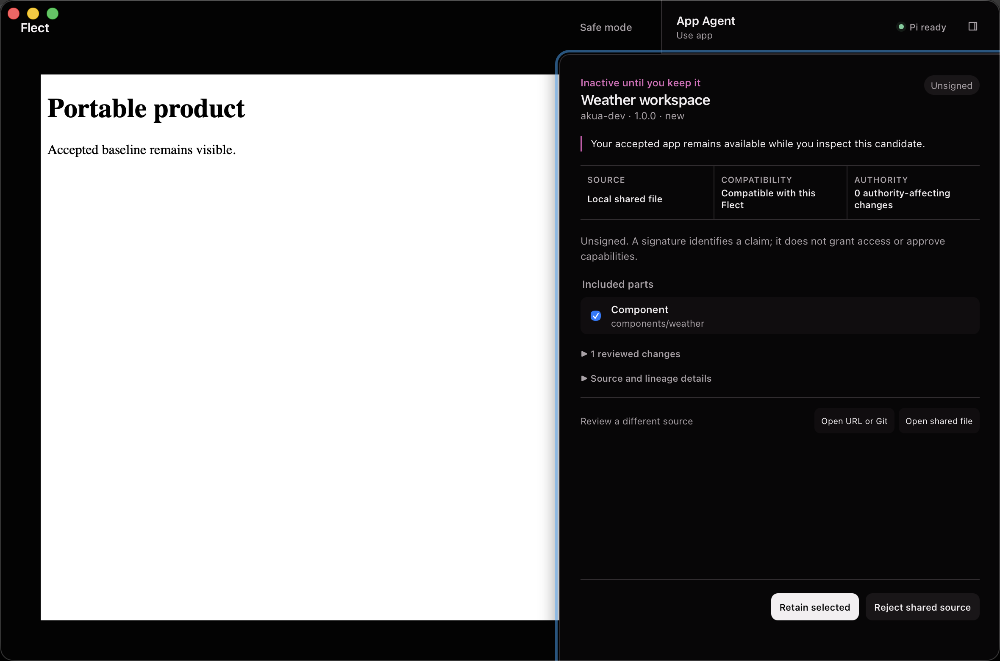
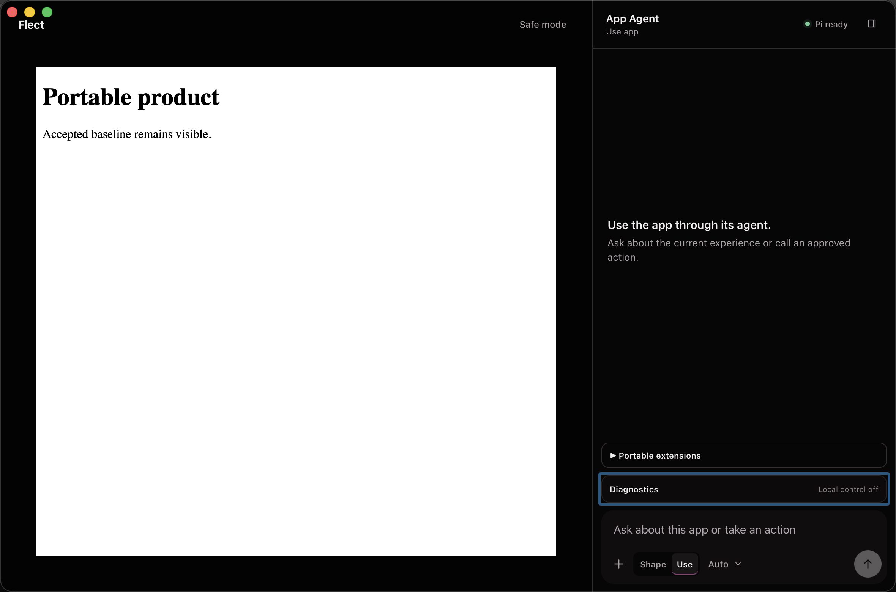

# Sharing and collaboration verification — 2026-08-03

## Outcome

Flect now has one browser-portable, inactive-by-default sharing lifecycle for
experiences, components, themes, workflows, and portable extensions. Local
files, credential-free HTTPS, exact public Git revisions, and named trusted
private adapters converge on the same strict review. Retained sources preserve
ordinary Git lineage in OPFS, personal Shaper checkpoints remain user-owned,
compatible updates retain personal work, and overlapping updates require an
explicit user or Shape decision before Preview and Keep.

This is implementation and local-dogfood evidence. It is not evidence of a
published release, public registry, verified publisher identity, real-time
multi-user editing, Developer ID signing, or notarization.

## Evidence boundary

The proof uses the dirty PR worktree on
`codex/flect-self-contained-shaper`, based on commit
`32d20f5dcb82af6cd53db9188bb029dd0d4012e4`. The worktree contains the broader
Flect PR and was intentionally not committed, pushed, merged, published, or
released while producing this report.

The supported proof hosts are production Chromium and the locally packaged
arm64 macOS app. Effect is pinned to `4.0.0-beta.102`; the matching local source
checkout resolved to `cccd029ae0124a33254b4094f1bc9c06cd43324e`.

## Observable sharing contract

- `.flect-share` is deterministic, bounded, and authority-free. Its manifest
  identifies exact source roots, compatibility, provenance, migrations,
  signature claims, and requested runtime artifacts.
- Local, HTTPS, public Git, and trusted private sources enter disposable
  quarantine and produce one inactive `ShareReview`. Opening a source never
  replaces the accepted app.
- Retain imports only reachable Git objects and creates opaque namespaced
  base/upstream/fork refs. It imports no grants or credentials.
- Shaper's reserved browser Bash can checkpoint explicitly named sandbox files
  against an exact fork commit. App Agent is denied.
- Clean personalized updates create a commit with the retained fork and exact
  upstream revision as verified parents and the complete deterministic tree.
- A conflict review exposes only **Continue with my fork**, **Open conflict in
  Shape**, and **Reject update**. Keep and generic Preview remain unavailable.
- Shape receives only the recorded base/fork/upstream conflict files below its
  role-owned sandbox. `flect share resolve` must name the exact three commits
  and resolve or remove every recorded path exactly once.
- Continue and Shape resolution both create an inactive candidate. Preview and
  Keep remain separate protected user decisions, and restart restores the
  pending candidate.
- Export emits the exact retained fork or candidate history, clears publisher
  signatures on derived work, and opens in native Git. Remove and irreversible
  delete are separate scopes; unrelated refs, grants, settings, and accepted
  interface state remain untouched.

Flect's bounded byte-level three-way comparison is the portable conflict
policy. During production Chromium proof, wasm-git auto-merged the one-line
overlap that the deterministic policy classified as a conflict. The protected
Worker now keeps the reviewed conflict set authoritative across Git-engine
heuristics while still constructing and validating the exact real two-parent
commit.

## Criterion classification

| Criterion | State | Observable proof |
| --- | --- | --- |
| `FQ-17.1` | proven | Local OPFS Git owns retained source and personal forks; native-Git-readable export preserves complete history. |
| `FQ-17.4` | proven | Upstream/product state cannot overwrite the guarded fork, import grants, or erase exportable user history. |
| `FQ-17.5` | proven | Export, remove, and separately confirmed namespaced deletion are documented and exercised without touching unrelated state. |
| `FQ-23.1` | proven | One all-five fixture installs every declared artifact kind inertly through the same share contract. |
| `FQ-23.2` | proven | Inactive review projects source, Git lineage, provenance, compatibility, signatures, migrations, extensions, agent-facing changes, and requested authority before activation. |
| `FQ-23.3` | proven | Real fast-forward, disjoint two-parent merge, continue-fork, and explicit overlapping resolution preserve the intended personal result. |
| `FQ-23.4` | proven | Proposed source and authority deltas remain inactive and attributable through exact Git revisions and the protected review/Preview/Keep sequence. |
| `FQ-23.5` | proven | Fork/export preserve attribution and exact parents while signatures and grants never become inherited authority. |
| `FQ-23.6` | proven | Local files and closure-private host adapters support private transfer without publication or a Flect account. |
| `FQ-23.7` | proven | Malformed archives and every valid untrusted artifact class remain contained in inspectable inactive review before any protected activation. |

These classifications cover the portable local sharing scope. Real-time remote
collaboration remains a separate product capability and is not implied.

## Focused and repeated proof

The final focused contract command passed 108 of 108 cases across nine files.
It covers strict command schemas, controller authorization and recovery,
conflict-specific UI actions, embedded Bash parsing, bounded role-owned tree
materialization, repository guards, generated AXI guidance, and share help.

The complete nine-test sharing spec then passed three consecutive production
Chromium repetitions:

```text
bunx playwright test tests/e2e/sharing.spec.ts \
  --project=chromium --repeat-each=3

27 passed (3.4m)
```

Those repetitions cover:

- install, Preview, Keep, export, remove, and explicit deletion;
- exact fast-forward update;
- prompted Shaper personalization and a real two-parent clean merge;
- explicit Shape conflict resolution and native verification of its exact
  parents and combined bytes;
- credential-free HTTPS, exact public Git clone, and closure-private adapters;
- five inert artifact kinds and malicious-archive recovery;
- 320 px layout, 200 percent text, axe, focus, and no automatic scroll; and
- no unexpected console, page, request, credential, accepted-state, or Local
  control failure.

Every exported repository inspected by the workflow passed native `git fsck`.
Derived exports carried no stale publisher signature.

## Complete gate

The exact installed source passed the full repository gate:

- Effect checkout and Rifty dependency/license checks: passed;
- generated Flect skill drift and product-quality coverage: passed;
- Biome: 427 files checked with no fixes;
- TypeScript project build: passed;
- Vitest: 148 files passed, 1 skipped; 803 tests passed, 1 skipped;
- Playwright: 77 of 77 production-Chromium workflows passed in 4.4 minutes;
- Rust formatting: passed;
- Rust: 21 of 21 native tests passed; and
- Tauri: an ordinary arm64 `Flect.app` built and was ad-hoc signed.

The first complete Playwright attempt passed 76 of 77. The outside-control test
had completed its App response and Bash activity, then intentionally tore down
the Pi session during safe-mode/control cleanup; Chromium reported the expected
closing prompt request as `net::ERR_ABORTED`, but that scenario had not marked
the completed prompt in the global failure collector. The evidence marker now
changes only after both public completion observations. That test passed three
consecutive isolated repetitions before the clean 77-of-77 run.

Vite reported its existing browser-externalization and large-chunk warnings.
They did not fail compilation, budgets, execution, or packaging.

## Installed ordinary app

The prior app was closed normally and moved recoverably to:

```text
/Users/robin/.Trash/Flect-before-sharing-20260803-085700.app
```

After the final public-SDK example was added and the ordinary bundle rebuilt,
the intermediate installed proof was moved recoverably to
`/Users/robin/.Trash/Flect-before-private-sharing-reference-20260803-091100.app`
before the final exact bundle was installed.

The exact gated bundle was copied to `/Applications/Flect.app`. Byte comparison
of both executables against the source bundle passed, as did
`codesign --verify --deep --strict`. Installed hashes are:

```text
flect
89a592b3ca436949e22fd1a482817e61c9bc2f17f12a376c77875d33d5b237f5

flect-runtime
7fc01f353bb848d91154924804f566470a39456732a7b3d4a0594caec61274c1
```

Signature facts are explicit: identifier `dev.akua.flect`, arm64 local build,
ad-hoc signature, hardened runtime, and no Team ID. This is not public
distribution signing.

The app was launched once. Process inspection found one main process and its
one private-runtime child. macOS accessibility found exactly one window with
**Pi ready**, an enabled App Agent composer, and **Local control off**.
Diagnostics exposed **Enable local control**, and no control descriptor existed.
No test server, diagnostic window, or stale Flect window remained.

The installed ordinary app then opened a real 23,552-byte local
`weather-workspace.flect-share` through the native file chooser. Accessibility
inspection proved the candidate was **Inactive until you keep it**, the accepted
Portable product remained visible, compatibility and unsigned/non-authority
copy were present, and only the selected component was staged. Reject returned
to the same accepted product with no pending review and still exactly one
window.



The native-review screenshot is 2360 by 1562 pixels with SHA-256
`ca16133863782df387dce8183689d0a33bcfbe29231b5c33c2d8672964f2b598`.



The screenshot is 2360 by 1562 pixels with SHA-256
`60188982c559a0ee6ca75b2c637b79ee84c2e4dd3274fcc0641bb2632386f853`.

## Current limits

- Public HTTPS and Git sources require browser-readable CORS responses. A
  trusted named adapter is required for authenticated or incompatible sources.
- Private-adapter code is trusted host code. Its credentials remain
  closure-private, but the adapter itself is not an untrusted extension.
- The stock Flect distribution intentionally registers no company-private
  adapter. Native product distributions compose one at their trusted host edge;
  the host-composed production-Chromium workflow and public SDK reference prove
  that boundary without fabricating company access in the ordinary app.
- Publisher signature verification remains a separate configured host service;
  signature presence alone is never trust or authority.
- Submodules, LFS, hooks, alternates, worktrees, rewritten lineage, and
  unbounded repository shapes fail closed with a documented portable
  alternative.
- Real-time multi-user editing, remote synchronized workspaces, a mandatory
  registry, and a Flect collaboration service are not part of this lifecycle.
- The installed app is local ad-hoc dogfood, not a notarized downloadable
  release.
- GitHub delivery remains review work: no commit, push, release, publish, issue
  closure, or project mutation was performed.
